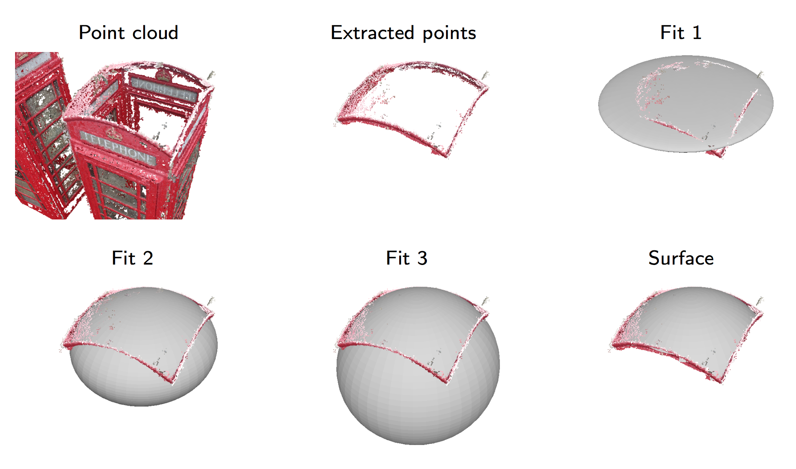

# BayesianQuadrics

## Introduction
This code is an octave and c++ implementation of the paper
 * ["Fitting quadrics with a Bayesian prior" - Daniel Beale et al. Journal of Computational Visual Media, 2016.](http://link.springer.com/article/10.1007/s41095-016-0041-9)

The library documentation can be found at [dabeale.github.io/BayesianQuadrics](http://dabeale.github.io/BayesianQuadrics).

## Installation
The software requires the matrix library Eigen in order to compile. Eigen can be found at [bitbucket.org/eigen/eigen/](https://bitbucket.org/eigen/eigen/), or installed using homebrew. 

Edit the makefile and change 
> INCLUDES:=/usr/local/Cellar/eigen/3.2.6/include/eigen3/ 

to the correct directory for the eigen header files.

GNU Octave must be installed in order to run the tests. It can be downloaded from [www.gnu.org/software/octave/](https://www.gnu.org/software/octave/), or installed using homebrew for mac. The statistics package is required (`pkg -forge install statistics`).

Enter the 'BayesianQuadrics' directory and run
> make

## Tests
From octave, enter the scripts directory and run,
> testQuadricFit

The code will generate an Output directory and a collection of ply files containing the points generated on the test quadric, and the fitted surfaces.

## Matlab compatibility
The code is compatible with matlab. If octave is installed you can run,
> make mex

to generate a mexfile for the c++ implementation.

